  

<table>
<tr>
<td width="400" valign="top"></td>
<td width="460" valign="top"></td>
</tr>
</table>

 

### What I actually shipped

**Cut insurance document validation from 30 minutes to 2 minutes per document.** Power Automate
and AI Builder for extraction, .NET rule validation behind it. That is the number I lead with.

Currently a Software Development Intern at **AhaApps Infotech** (Hyderabad, onsite), working full
stack on an enterprise 360-degree employee evaluation platform:

- React 18 survey, reporting and admin interfaces on ASP.NET Core (.NET 10) REST APIs, deployed
  across dev, test and prod
- A weighted scoring engine — 40/40/20 standard, 50/50 exception fallback — with proportional
  weight redistribution when a category has no responses
- A deterministic anonymization service that still preserves self-evaluation context
- An async email-queue worker on .NET `IHostedService` with retry logic and HTML templating
- A headless-Chromium PDF report generator (PuppeteerSharp) reusing a singleton browser instance
- SQL Server composite indexes plus single-pass score aggregation for reporting performance
- Multi-environment CI/CD on Azure DevOps with branch-level config validation

Concurrently a **Core Java Developer Intern at Virtusa** (remote, held alongside the AhaApps
internship) — Spring Boot backend services for a logistics system: role-based auth,
inventory and delivery workflows, MySQL schema design, React frontend integration. I earned
that internship by co-developing a traffic-violation reporting platform at the Virtusa Hackathon.

 

### Things I built

| Project | What it does | Stack |
|---|---|---|
| **Natural Language → SQL on offline LLMs** | Lets non-technical users query relational databases in plain English. Schema-aware prompting, query validation before anything touches the database, fully offline models. | Python · LangChain · local LLMs · SQL |
| **Federated Learning in Healthcare Informatics** | Privacy-preserving training across decentralized healthcare sources — the model travels, the data never does. | Flower · TensorFlow |
| **Backend Inventory & Delivery System** | Role-based inventory and delivery tracking with REST APIs for stock updates, delivery status and reporting. | Spring Boot · Spring Security · MySQL |
| **Distracted Driver Detection** | CNN classifier over driver-cabin imagery with alerting on detection. | VGG16 · OpenCV · Flask |

 

### Stack

**Backend** — ASP.NET Core (.NET 10) · Spring Boot · REST API design · async workers 
**Languages** — C# · Java · Python · SQL 
**Frontend** — React 18 · HTML · CSS 
**Data** — SQL Server · MySQL · MongoDB 
**Cloud & DevOps** — Azure App Services · Azure DevOps · AWS EC2/S3 · Docker · GitHub Actions 
**AI & Automation** — LangChain · offline LLMs · prompt engineering · Power Platform · AI Builder

Certified: **Microsoft Azure AI Fundamentals (AI-900)**, **Oracle Cloud Infrastructure 2024 AI
Foundations Associate**.

 

### Reach me

**[bhanuprasadhere.github.io](https://bhanuprasadhere.github.io)** ·
**[LinkedIn](https://linkedin.com/in/bhanuprasadhere)** ·
**[bhanuprasas007@gmail.com](mailto:bhanuprasas007@gmail.com)**

Integrated M.Tech in Computer Science, VIT — graduating 2026. Open to backend, full stack and
AI engineering roles in Hyderabad and Bangalore.

 

Every graphic above is a self-contained SVG generated from
<a href="scripts/">scripts/</a> and committed to this repo — no third-party widget services, so
nothing here rate-limits or 404s. The heatmap refreshes daily via
<a href=".github/workflows/update-profile-art.yml">GitHub Actions</a>.
